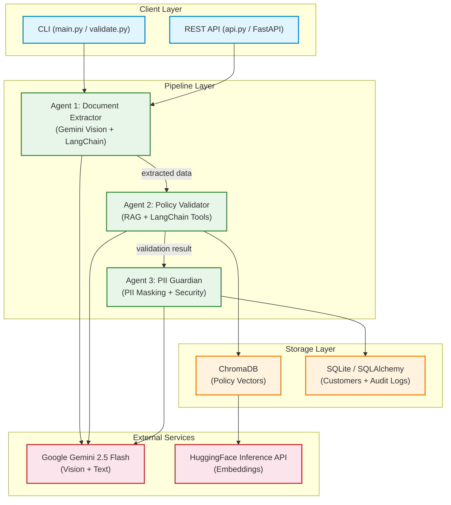
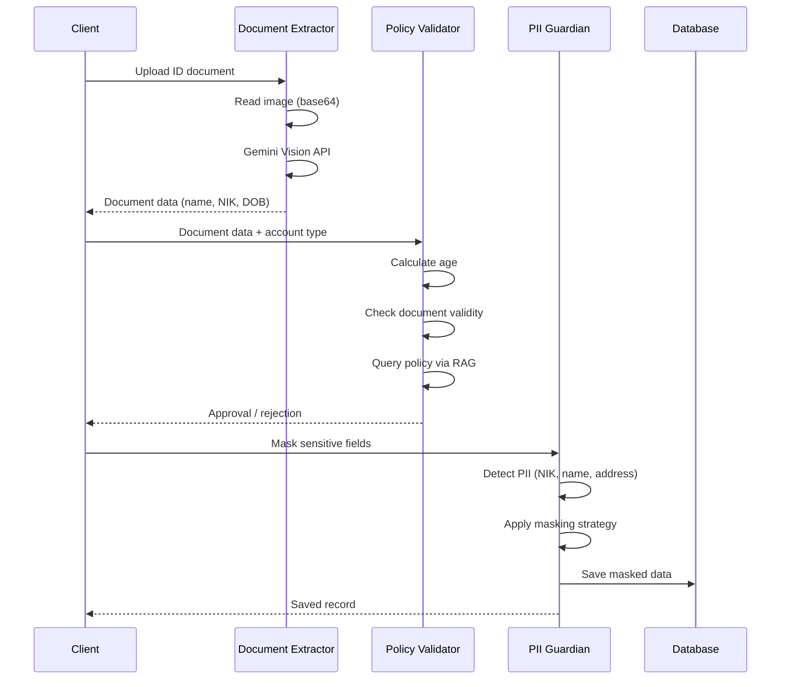

<p align="center">
  
  
  
  
  
  
</p>

# 🤖 Multi-Agent Customer Onboarding System

<p align="center">
  <b>An intelligent multi-agent system for automated customer onboarding validation using LangChain, RAG, and Vision AI</b>
</p>

---

## 🎯 Project Overview

This project demonstrates a **production-ready multi-agent architecture** for automating customer onboarding in financial services. The system combines **Computer Vision**, **RAG (Retrieval-Augmented Generation)**, and **Data Security** principles to create a seamless, secure, and compliant onboarding workflow.

## 🗺️ Architecture



### Data Flow



---

## ✨ Key Features

| Feature | Description | Technology |
|---------|-------------|------------|
| 🔍 **Document Extraction** | Auto-extract data from ID cards (KTP, Passport) using Vision AI | Gemini 2.5 Flash |
| 📋 **Policy Validation** | Validate customer eligibility against compliance policies using RAG | HuggingFace + LangChain |
| 🔒 **PII Protection** | Automatic masking of sensitive data before storage | Custom + LangChain Middleware |
| 📊 **Structured Output** | Type-safe responses using Pydantic schemas | Pydantic v2 |
| 🗄️ **Audit Trail** | Complete logging with data protection compliance | JSON-based simulation |

---

## 🚀 Agents

### Agent 1: Document Extractor (Vision Agent)

Extracts structured data from identity document photos using **Google Gemini Vision Model**.

**Capabilities:**
- Reads Indonesian ID cards (KTP), Passports, and Driver's Licenses (SIM)
- Extracts: Name, NIK (16-digit ID), Date of Birth, Address, Expiry Date
- Provides confidence score for extraction quality
- Handles various image formats (JPG, PNG, WebP)

**Tech Stack:** `LangChain create_agent()` · `Gemini 2.5 Flash` · `Pydantic`

---

### Agent 2: Policy Validator (RAG Agent)

Validates customer eligibility against company policies using **Retrieval-Augmented Generation**.

**Capabilities:**
- Age verification for different account types (Stocks: 18+, Futures: 21+, Crypto: 25+)
- Document validity checking
- Policy-based decision making with explanations
- Returns approval status with policy references

**Tech Stack:** `LangChain Tools` · `HuggingFace Embeddings` · `ChromaDB Vector Store`

---

### Agent 3: PII Guardian (Security Agent)

Protects sensitive personal information before logging or storage.

**Capabilities:**
- Detects Indonesian PII: NIK, Phone, Email, Name, Address, Birth Date
- Multiple masking strategies: redact, mask, hash, tokenize
- Automatic masking before database storage
- Audit logging for compliance

**Tech Stack:** `LangChain PIIMiddleware` · `Regex Patterns` · `SQLAlchemy + SQLite`

---

## 📦 Installation

### Prerequisites

- Python 3.10+
- Google API Key for Gemini
- Docker (optional, for containerized deployment)

### Quick Start (Local)

```bash
# 1. Clone the repository
git clone https://github.com/jelimutaalidev/multi-agent-onboarding.git
cd multi-agent-onboarding

# 2. Create virtual environment
python -m venv venv
source venv/bin/activate  # Linux/Mac
# .\venv\Scripts\Activate  # Windows

# 3. Install dependencies
make install

# 4. Configure API key
cp .env.example .env
# Edit .env and add your GOOGLE_API_KEY (get one at https://aistudio.google.com)
```

### Quick Start (Docker)

```bash
# 1. Configure API key
cp .env.example .env
# Edit .env and add your GOOGLE_API_KEY

# 2. Build and run
make docker-up

# Open http://localhost:8000/docs

# 3. View logs
make docker-logs

# 4. Stop
make docker-down
```

### Dependencies

```
langchain>=0.3.0
langchain-google-genai>=2.0.0
langgraph>=0.2.0
langchain-huggingface>=0.1.0
sentence-transformers>=2.0.0
pydantic>=2.0.0
python-dotenv>=1.0.0
```

---

## 🎮 Usage

### Full Pipeline (Recommended)

```bash
# Basic validation
python validate.py test_images/sample_ktp.png --account-type Futures

# With PII masking and database save
python validate.py test_images/sample_ktp.png -a Futures --save --show-pii-report
```

### Document Extraction Only

```bash
python main.py test_images/sample_ktp.png
```

### REST API Server

```bash
# Start locally
make api        # http://localhost:8000/docs

# Start with Docker
make docker-up  # http://localhost:8000/docs
```

```bash
# Validate a document via API
curl -X POST http://localhost:8000/api/v1/validate \
  -F "file=@test_images/sample_ktp.png" \
  -F "account_type=Futures"

# Health check
curl http://localhost:8000/api/v1/health

# List customers
curl http://localhost:8000/api/v1/customers

# List audit logs
curl http://localhost:8000/api/v1/audit-logs
```

### Python SDK

```python
from src.agent import extract_document_data
from src.policy_validator import validate_customer_from_document_data
from src.pii_guardian import process_and_save_customer

# Step 1: Extract document data
document_data = extract_document_data("path/to/ktp.jpg")

# Step 2: Validate against policies
validation = validate_customer_from_document_data(document_data, "Futures")

# Step 3: Save with PII protection
if validation["status"] == "APPROVED":
    record = process_and_save_customer(document_data, validation)
```

---

## 📊 Example Output

### Successful Onboarding (APPROVED)

```
======================================================================
[ONBOARDING] Customer Onboarding Validation System
======================================================================

[STEP 1] Document Extraction
   ✓ Name: BUDI SANTOSO
   ✓ NIK: 3201234567890001
   ✓ Age: 35 years
   ✓ Confidence: 98%

[STEP 2] Policy Validation
   ✓ Account Type: Futures (min age: 21)
   ✓ Status: APPROVED

[STEP 3] PII Protection
   ✓ Detected: 5 PII fields
   ✓ NIK Masked: xxxx-xxxx-xxxx-0001
   ✓ Name Masked: BUD***

[STEP 4] Database Save
   ✓ Customer ID: CUST-20260116061221
   ✓ PII Masked: True
```

### Failed Onboarding (REJECTED)

```
[STEP 2] Policy Validation
   ✗ Account Type: Futures (min age: 21)
   ✗ Customer Age: 20 years
   ✗ Status: REJECTED

   Reason: Customer age (20) is below minimum requirement (21) for Futures trading.
   
   Recommendations:
   - Apply again after reaching 21 years of age
   - Consider other account types suitable for current age
```

---

## 📁 Project Structure

```
multi-agent-onboarding/
├── 📄 README.md                 # Documentation
├── 📄 requirements.txt          # Python dependencies
├── 📄 .env.example              # Environment template
├── 📄 .gitignore                # Git ignore rules
├── 🐳 Dockerfile                # Container build
├── 🐳 docker-compose.yml        # Multi-service orchestration
├── 📋 Makefile                  # Developer task runner
│
├── 🐍 main.py                   # CLI - Document extraction only
├── 🐍 validate.py               # CLI - Full pipeline (agent + policy + PII)
├── 🐍 api.py                    # CLI - FastAPI server entry point
│
├── 📂 src/
│   ├── 🐍 __init__.py
│   ├── 🐍 agent.py              # Agent 1: Document Extractor (Vision)
│   ├── 🐍 policy_validator.py   # Agent 2: Policy Validator (RAG)
│   ├── 🐍 pii_guardian.py       # Agent 3: PII Guardian (Security)
│   ├── 🐍 rag_store.py          # Vector Store (ChromaDB) + Retrieval
│   ├── 🐍 database.py           # SQLite via SQLAlchemy ORM
│   ├── 🐍 schemas.py            # Pydantic schemas
│   └── 🐍 api.py                # FastAPI application
│
├── 📂 tests/
│   ├── 🐍 conftest.py           # Shared test fixtures
│   ├── 🐍 test_agent.py         # Agent tests
│   ├── 🐍 test_policy_validator.py
│   ├── 🐍 test_pii_guardian.py
│   ├── 🐍 test_database.py
│   ├── 🐍 test_rag_store.py
│   ├── 🐍 test_schemas.py
│   └── 🐍 test_api.py           # API endpoint tests
│
├── 📂 data/
│   ├── 📂 policies/             # Compliance documents for RAG
│   │   └── 📄 exante_compliance_policy_2025.txt
│   ├── 📂 chroma_db/            # Persistent vector store (runtime)
│   └── 📂 db/                   # SQLite database (runtime)
│       └── 🗄️ onboarding.db
│
├── 📂 test_images/              # Sample test images
│   ├── 🖼️ sample_ktp.png        # Adult (35 years) → APPROVED
│   └── 🖼️ sample_ktp_young.png  # Young (20 years) → REJECTED
│
└── 📂 .github/workflows/
    └── ⚙️ ci.yml                # GitHub Actions CI
```

---

## 🧪 Testing

### Test Cases

| Test Case | Input | Expected Result |
|-----------|-------|-----------------|
| Adult + Futures | KTP (35 years) + Futures | ✅ APPROVED |
| Underage + Futures | KTP (20 years) + Futures | ❌ REJECTED |
| Adult + Crypto | KTP (35 years) + Crypto | ✅ APPROVED |
| Young + Crypto | KTP (35 years < 25) + Crypto | ❌ REJECTED |

### Run Tests

```bash
# All unit tests
make test

# Specific test file
python -m pytest tests/test_api.py -v

# Test approval case
python validate.py test_images/sample_ktp.png -a Futures

# Test rejection case
python validate.py test_images/sample_ktp_young.png -a Futures

# Manual pipeline (with save & PII report)
python validate.py test_images/sample_ktp.png -a Crypto --save --show-pii-report
```

---

## 🔧 Configuration

### Model Configuration

Edit `src/agent.py` to change the Vision model:

```python
agent = create_agent(
    model="google_genai:gemini-2.5-flash",      # Default - Fast
    # model="google_genai:gemini-2.5-pro",      # More accurate
)
```

### PII Masking Strategies

Available in `src/pii_guardian.py`:

| Strategy | Example | Use Case |
|----------|---------|----------|
| `mask` | `1234xxxx5678xxxx` | Partial visibility |
| `redact` | `[REDACTED_NIK]` | Complete removal |
| `hash` | `[HASH:a8f5f167...]` | Reversible mapping |
| `tokenize` | `[TOKEN:nik_0001]` | Unique identifiers |

---

## 🔐 Security Considerations

- ✅ PII is automatically masked before logging
- ✅ Sensitive data never stored in plain text
- ✅ Audit trail for all operations
- ✅ Environment variables for API keys
- ⚠️ This is a demo - use proper encryption for production

---

## 🛣️ Roadmap

- [x] FastAPI REST endpoint (`/health`, `/validate`, `/customers`, `/audit-logs`)
- [x] SQLite database with SQLAlchemy ORM
- [x] ChromaDB persistent vector store
- [x] Comprehensive pytest test suite (81 tests)
- [x] Docker containerization
- [x] CI/CD with GitHub Actions
- [ ] PostgreSQL production database
- [ ] LangSmith observability
- [ ] Load testing (k6/Locust)
- [ ] Kubernetes deployment manifests

---

## 📚 Technologies Used

| Category | Technology |
|----------|------------|
| **LLM Framework** | LangChain v1.2+, LangGraph |
| **Vision Model** | Google Gemini 2.5 Flash |
| **Embeddings** | HuggingFace Inference API (sentence-transformers) |
| **Vector Store** | ChromaDB (persistent) |
| **Database** | SQLAlchemy + SQLite |
| **API Framework** | FastAPI + Uvicorn |
| **Data Validation** | Pydantic v2 |
| **Containerization** | Docker + Docker Compose |
| **CI/CD** | GitHub Actions |
| **Language** | Python 3.10+ |

---

## 👨‍💻 Author

**Moh. Jeli Almutaali**
- GitHub: [@jelimutaalidev](https://github.com/jelimutaalidev)
- LinkedIn: [Moh. Jeli Almutaali](https://linkedin.com/in/moh-jeli-almutaali-5b09772b9)
- Email: jelimutaalidev@gmail.com

---

## 📝 License

This project is licensed under the MIT License - see the [LICENSE](LICENSE) file for details.

---

<p align="center">
  <b>⭐ Star this repo if you find it useful! ⭐</b>
</p>
